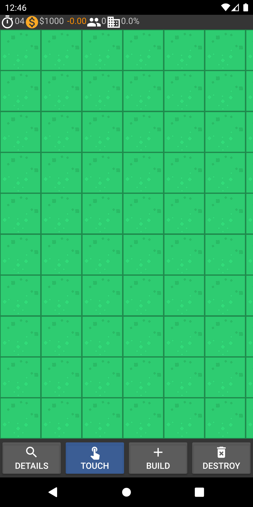

# MadCity
Assignment for mobile application development @ Curtin 2019

[Assignment specifacation](./MAD_2019s2_Assignment.pdf)
## Potential Improvements
* Formats on settings eg $ on the salary settings
* Allow the user to select a photo from gallary in map details
* significantly improve the poorly designed database

## Camera Permissions
```
Assignment camera/permissions issue
Posted on: Thursday, 24 October 2019 09:08:35 o'clock AWST
Hi all,

A number of people have encountered permission-related problems accessing the camera app, for the purposes of taking a thumbnail photo (as per section 5.2 of the assignment).

While some people have evidentially solved this (using advice from the official guide*), I can't reproduce the problem myself, and in this situation it's difficult for me to provide good advice to everyone else!

Therefore, I'm going to consider this requirement a "bonus". You will be able to get 100% on the assignment without implementing thumbnail photos, if you get everything else right. However, if you do implement thumbnail photos (and they work), you will get bonus marks that can make up for marks lost elsewhere. Your overall mark will still be capped at 100% though.

However, also be aware that if your app crashes for any other reason, that's your own problem! ;-)

* https://developer.android.com/training/permissions/requesting

- Dave
```

## Marks 

| Criterion                   | Mark    |
|-----------------------------|---------|
| 1. Title Screen             | 1 / 1   |
| 2. Settings Functionality   | 3 / 3   |
| 3. Basic Map Display        | 2 / 2   |
| 4. Building & Demolition    | 4 / 4   |
| 5. Gameplay & Status Info   | 4 / 4   |
| 6. Database Persistence     | 4 / 4   |
| 7. Details Screen           | 2 / 2   |
| 8. Structure Photos (bonus) | 2       |
| 9. Code Quality             | 5 / 5   |
| Total                       | 25 / 25 |

## Screenshots




